# Final project — an MLOps platform on AWS

An end-to-end MLOps platform on AWS EKS. Terraform builds the AWS side, Argo CD
deploys everything that runs in the cluster, a self-hosted MLflow server keeps
the experiments and the model versions, and a FastAPI service serves one
version of the model. New versions go out as canary releases with Argo
Rollouts, and a bad one rolls itself back. Prometheus, Grafana and Loki collect
metrics and logs, Evidently checks the live data for drift, and GitHub Actions
runs the pipelines.

The model is a small scikit-learn regression on the California Housing dataset.
That is on purpose: the project is about the platform, not about the model.

## Contents

- [Architecture](#architecture)
- [Repository structure](#repository-structure)
- [Requirements](#requirements)
- [Deploy from zero](#deploy-from-zero)
- [Namespaces](#namespaces)
- [Access to the user interfaces](#access-to-the-user-interfaces)
- [Observability](#observability)
- [Model registry and promotion](#model-registry-and-promotion)
- [Deployment strategy](#deployment-strategy)
- [Rollback](#rollback)
- [Security baseline](#security-baseline)
- [Tests and CI](#tests-and-ci)
- [Run everything locally](#run-everything-locally)
- [Code quality](#code-quality)
- [Cost](#cost)
- [Teardown](#teardown)
- [Documents](#documents)

## Architecture

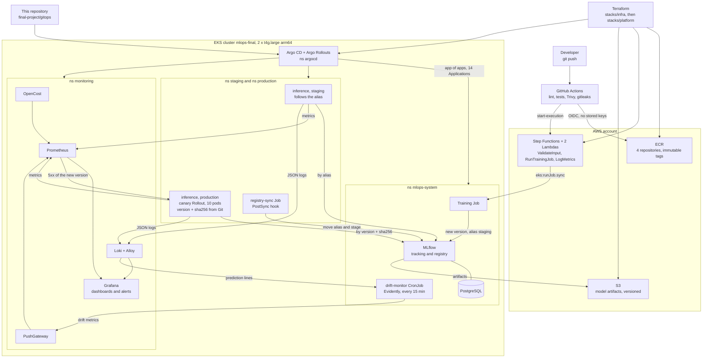

Two things are worth reading twice:

- **Terraform stops at Argo CD.** It creates AWS resources, the namespaces and
  the two generated passwords, then installs Argo CD and one root Application.
  Everything else is deployed from `gitops/` by Argo CD. There is no
  `kubectl apply` and no `helm install` in any instruction below.
- **Training and deployment are separate pipelines.** Training is started by
  hand from a workflow and ends with a new version under the alias `staging`.
  Deployment to production is a commit that changes two lines in a values file.

## Repository structure

```
final-project/
├── terraform/                  AWS, in two stacks
│   ├── modules/
│   │   ├── vpc/                network, two AZs, one NAT gateway
│   │   ├── eks/                cluster, arm64 node group, add-ons, access entries
│   │   ├── ecr/                four image repositories, immutable tags
│   │   ├── ci-access/          GitHub OIDC provider and the CI role
│   │   ├── argocd/             the argo-cd chart and the root Application
│   │   ├── mlflow/             S3 bucket, Pod Identity role, the Postgres secret
│   │   ├── monitoring/         the Grafana admin secret
│   │   └── training-pipeline/  two Lambdas and the Step Functions state machine
│   └── stacks/
│       ├── infra/              vpc + eks + ecr + ci-access      (apply first)
│       └── platform/           namespaces + mlflow + monitoring + pipeline + argocd
├── gitops/                     everything Argo CD deploys
│   ├── bootstrap/              the app-of-apps chart: one Application per component
│   ├── apps/<name>/            values of a third-party chart, or plain manifests
│   ├── charts/inference/       our chart: Rollout, Service, analysis, registry hook
│   ├── charts/drift-monitor/   our chart: the CronJob
│   └── envs/                   staging.yaml and production.yaml — edited day to day
├── rbac/                       roles for mlops-engineer, viewer and the pipeline
├── lambda/                     the two Lambda handlers of the training pipeline
├── services/
│   ├── training/               trains a model and registers a version
│   ├── inference/              FastAPI service that serves one version
│   ├── registry-ops/           promote, roll back, delete, with an audit line
│   └── drift-monitor/          Evidently job that looks for data drift
├── scripts/                    state bucket, dataset, traffic, local e2e, validation
├── data/                       the California Housing snapshot and the reference sample
├── docs/                       screenshots, threat model, escalation policy
├── docker-compose.yml          the whole stack on one machine
├── .gitlab-ci.yml              the same pipeline written for GitLab
├── README.md   RUNBOOK.md   ADR.md
```

The two GitHub workflows are at **`.github/workflows/`** in the root of the
repository, because GitHub only reads workflows from there:

| Workflow | Trigger | What it does |
|---|---|---|
| `final-project-ci.yml` | push and pull request on `final-project` | lint, tests, Terraform, GitOps, image build and scan, secret scan, image push |
| `final-project-train.yml` | manual | starts the training pipeline and waits for the result |

## Requirements

| Tool | Version | Used for |
|---|---|---|
| Terraform | 1.10 or newer | creating the infrastructure (`use_lockfile` needs 1.10) |
| AWS CLI | 2.x | access to the account, `aws eks update-kubeconfig` |
| kubectl | 1.30 or newer | working with the cluster |
| Helm | 3 or 4 | checking charts before Argo CD syncs them |
| Docker | any recent | building the service images and the local stack |
| uv | 0.8 or newer | Python 3.13 and the Python tools |
| `kubectl-argo-rollouts` | 1.10 | watching and aborting a canary — optional, `kubectl` works too |
| kubeconform, kustomize, yq | 0.8 / 5.8 / 4.53 | only for `scripts/validate_gitops.sh` |

An AWS account with administrator rights, and a profile named `goit`
(`aws_profile` is a variable if the name is different; the two `backend` blocks
hardcode it, because a backend block cannot use variables).

Install the plugin for the canary commands:

```bash
brew install argoproj/tap/kubectl-argo-rollouts
```

## Deploy from zero

Nine steps. Nothing happens outside this list.

### Step 0 — prerequisites and the state bucket

Terraform keeps its state in S3, so the state does not depend on which branch
is checked out. The bucket is **not** managed by Terraform: if it were,
`terraform destroy` would delete the state file it is supposed to protect.

It already exists for this account. On an empty account, create it once:

```bash
cd final-project
BUCKET=my-tfstate-bucket-<something unique> AWS_PROFILE=goit \
  ./scripts/create_state_bucket.sh
```

The script is safe to run again. It creates the bucket, blocks all public
access, turns on versioning and turns on AES256 encryption. If you used your
own name, change the `bucket` line in `terraform/stacks/infra/backend.tf` and
`terraform/stacks/platform/backend.tf`.

Locking is `use_lockfile = true`, so there is no DynamoDB table.

### Step 1 — the infra stack

```bash
cd final-project/terraform/stacks/infra
terraform init
terraform apply
```

About 15 minutes; almost all of it is the EKS control plane. This creates the
VPC, the cluster with one arm64 node group, the four ECR repositories, the
GitHub OIDC provider and the CI role.

Write down two outputs:

```bash
terraform output ci_role_arn                 # -> repository variable AWS_ROLE_ARN
terraform output update_kubeconfig_command
```

### Step 2 — point kubectl at the cluster

```bash
aws eks update-kubeconfig --name mlops-final --region us-east-1 --profile goit
kubectl get nodes          # two nodes, Ready
```

### Step 3 — repository variables, and push the images

In GitHub: **Settings → Secrets and variables → Actions → Variables**. These
are *variables*, not secrets: none of them is confidential on its own, and a
variable is visible in the log, which makes a failing run much easier to read.

| Variable | Value | From |
|---|---|---|
| `AWS_ROLE_ARN` | `arn:aws:iam::<account-id>:role/mlops-final-github-actions` | step 1, output `ci_role_arn` |
| `AWS_REGION` | `us-east-1` | |
| `STATE_MACHINE_ARN` | filled in at step 5 | |

With `AWS_ROLE_ARN` set, the `push-images` job stops being skipped. Run it
once: **Actions → final-project-ci → Run workflow** on branch `final-project`.
It builds the four images and pushes them to ECR tagged with the **full 40
character commit SHA**, and prints the result in the job summary without the
registry host (the host contains the account id and this repository is public).

Copy that commit SHA. Step 4 needs it.

### Step 4 — point the charts at the images you just pushed

This is the one order that has to be right. Argo CD syncs the inference and
drift Applications in the last wave; if the tag in Git names an image that is
not in ECR, those pods sit in `ImagePullBackOff`. So the images go first and
the tags are set **before** Argo CD ever runs.

Edit four lines to the SHA from step 3:

| File | Key |
|---|---|
| `gitops/envs/staging.yaml` | `imageTag` |
| `gitops/envs/production.yaml` | `imageTag` |
| `gitops/envs/production.yaml` | `registryOpsImageTag` |
| `gitops/charts/drift-monitor/values.yaml` | `imageTag` |

```bash
git commit -am "Deploy the images of <sha>"
git push
```

This push starts CI again and pushes a second set of images under the new
commit SHA. That is harmless — the tags in the files still name the images from
step 3, which exist.

### Step 5 — the platform stack

```bash
cd ../platform
terraform init
terraform apply
```

About five minutes. This creates the five namespaces, the two generated
secrets, the MLflow S3 bucket and its Pod Identity role, the two Lambdas and
the Step Functions state machine, and finally Argo CD with one root
Application.

Now fill in the third repository variable:

```bash
terraform output state_machine_arn     # -> repository variable STATE_MACHINE_ARN
```

### Step 6 — watch Argo CD sync

```bash
kubectl -n argocd port-forward svc/argocd-server 8080:80
kubectl -n argocd get secret argocd-initial-admin-secret \
  -o jsonpath='{.data.password}' | base64 -d; echo
```

Open <http://localhost:8080> and log in as `admin`. The root Application
`mlops-platform` creates fourteen child Applications and syncs them in waves:

| Wave | Applications |
|---|---|
| 0 | `rbac`, `argo-rollouts`, `postgres` |
| 1 | `mlflow`, `prometheus`, `pushgateway`, `loki` |
| 2 | `alloy`, `grafana`, `grafana-dashboards`, `opencost` |
| 3 | `inference-staging`, `inference-production`, `drift-monitor` |

From the command line:

```bash
kubectl -n argocd get applications
kubectl get pods -A
```

It takes about ten minutes for everything to be `Synced`.

**Expected at this point:** the inference pods start but stay **not ready**.
There is no model in the registry yet, so `/health/ready` answers 503 and both
inference Applications show `Progressing`. That is the design: a pod without a
checked model never takes traffic. It is fixed by the next step.

### Step 7 — the first training run

**Actions → final-project-train → Run workflow.** Leave every input empty.

The workflow starts the state machine, which validates the input, runs a
Kubernetes Job in `mlops-system` with the training image, waits for it, reads
the `training_finished` line out of the pod's logs and returns it. The job
summary then shows the version, `rmse`, `mae`, `r2`, `run_id`,
`dataset_sha256` and `model_sha256`.

A run on the full dataset takes two or three minutes.

### Step 8 — staging picks it up, then promote

The training job gives the new version the alias `staging`. The staging pods
check that alias every 60 seconds and load the new model without restarting.

```bash
kubectl -n staging port-forward svc/inference 8000:80
curl -s localhost:8000/info | jq
curl -s localhost:8000/health/ready -o /dev/null -w '%{http_code}\n'   # 200
```

When it looks right, promote it. Edit two lines in
`gitops/envs/production.yaml` with the numbers from step 7:

```yaml
modelVersion: "1"
modelSha256: "<the 64 hex characters>"
```

```bash
git commit -am "Promote model version 1 to production"
git push
```

Argo CD syncs within a minute. Because this is the first version production
ever had, Argo Rollouts brings all ten pods up at once instead of running the
canary steps — there is nothing to compare against. Every promotion after this
one is a real canary.

When the Rollout is healthy, the `PostSync` hook Job runs
`registry_ops sync --production-version 1`, which sets the alias `production`
and the stage `Production` and prints one JSON audit line.

### Step 9 — verify

```bash
# every Application Synced and Healthy
kubectl -n argocd get applications

# production serves the pinned version
kubectl -n production port-forward svc/inference 8000:80 &
curl -s localhost:8000/info | jq '.model_version, .model_sha256'

# the registry agrees
kubectl -n production logs job/inference-registry-sync

# traffic, so the dashboards and the drift job have something to show
python3 scripts/send_traffic.py --mode normal --count 500 --rate 15 \
  --url http://localhost:8000
```

Then open Grafana (below) and look at the *Inference* dashboard. After the next
quarter of an hour the drift CronJob has run and the *Model quality* dashboard
has numbers as well.

> `TODO(after deploy): add the screenshots of the deployed system — Argo CD with
> every Application Synced/Healthy, the MLflow registry with a version in
> Production, the three Grafana dashboards, and a canary rollout in progress.`

## Namespaces

One cluster, five namespaces. All of them are created by Terraform, never by
Argo CD, because Terraform also writes the two generated secrets into them.
Every Application therefore syncs with `CreateNamespace=false`.

| Namespace | What lives there | Who may change it |
|---|---|---|
| `argocd` | Argo CD server, controller, repo server, Redis; the root Application and its fourteen children | nobody by hand — it is Terraform and Git |
| `mlops-system` | MLflow, PostgreSQL, the Argo Rollouts controller, the training Jobs started by Step Functions, the drift CronJob | `mlops-engineers`: read and port-forward |
| `staging` | one inference release that follows the alias `staging` | `mlops-engineers`: full access, including Secrets and `exec` |
| `production` | one inference release pinned to a version and a checksum, plus the registry-sync hook Job | `mlops-engineers`: read, port-forward, and abort a canary — no writes |
| `monitoring` | Prometheus, Grafana, Loki, Alloy, PushGateway, OpenCost, the Grafana admin secret | `mlops-engineers`: read and port-forward |

The boundary between staging and production is the point of the split:
**staging follows an alias and changes by itself; production only changes
through a commit.** The RBAC in [`rbac/`](rbac/README.md) enforces it — an
engineer who could `patch` the production Rollout could change what runs
without a commit, so that right is not granted.

## Access to the user interfaces

**Nothing in this project is public**, and that is a decision, not a gap:

- There is no attack surface on the internet. MLflow and the Prometheus UI have
  no login at all, so publishing them would mean putting authentication in
  front of them first.
- No load balancer, no Route 53 zone, no ACM certificate: the cluster costs
  $0.28 an hour and an ALB would add about a third to that for no benefit.
- `ingress-nginx` was archived in March 2026 and receives no fixes, so the
  obvious free option is not one any more.

The cost is that a reviewer needs `kubectl` and this section instead of a link.
Each command opens one port and holds it until `Ctrl+C`.

| What | Command | Address | Login |
|---|---|---|---|
| Argo CD | `kubectl -n argocd port-forward svc/argocd-server 8080:80` | <http://localhost:8080> | `admin`, password below |
| MLflow | `kubectl -n mlops-system port-forward svc/mlflow 5000:5000` | <http://localhost:5000> | none |
| Grafana | `kubectl -n monitoring port-forward svc/grafana 3000:80` | <http://localhost:3000> | `admin`, password below |
| Prometheus | `kubectl -n monitoring port-forward svc/prometheus-server 9090:80` | <http://localhost:9090> | none |
| inference, production | `kubectl -n production port-forward svc/inference 8000:80` | <http://localhost:8000> | none |
| inference, staging | `kubectl -n staging port-forward svc/inference 8001:80` | <http://localhost:8001> | none |

```bash
# Argo CD: created by the chart on the first install
kubectl -n argocd get secret argocd-initial-admin-secret \
  -o jsonpath='{.data.password}' | base64 -d; echo

# Grafana: generated by Terraform (random_password) and written into a Secret
kubectl -n monitoring get secret grafana-admin \
  -o jsonpath='{.data.admin-password}' | base64 -d; echo
```

No password is ever printed by `terraform output`. The outputs give the
`kubectl` command that reads the secret when it is needed, so the value never
lands in a terminal scrollback or in a screenshot by accident.

> A port-forward binds to one **pod**, not to the Service. Restarting that pod
> kills the forward without a message.

## Observability

### Metrics

The inference service exports the defaults of
`prometheus-fastapi-instrumentator` plus six custom metrics. Every one of them
carries the model version, which is what makes a canary comparable with the
version it is replacing.

| Metric | Labels | What it answers |
|---|---|---|
| `inference_requests_total` | `model_version`, `status_class` | request rate and error rate, per version |
| `inference_request_duration_seconds` | `model_version` | latency, histogram from 2 ms to 2.5 s |
| `inference_predictions_total` | `model_version` | how much traffic a version really served |
| `inference_prediction_value` | `model_version` | the answers themselves, to see a version go wrong |
| `inference_model_info` | `model_name`, `model_version`, `model_sha256` | which model a pod has loaded |
| `inference_model_load_failures_total` | `reason` | failed loads, `checksum_mismatch` above all |

Pod CPU and memory come from cAdvisor and kube-state-metrics, which the
Prometheus chart installs. The drift job pushes `data_drift_share`,
`data_drift_score{column}`, `data_drift_samples`,
`data_drift_columns` and `data_drift_last_run_timestamp_seconds` to the
PushGateway, which Prometheus scrapes with `honor_labels: true` — without that
the column name on each score would be overwritten.

### Logs

Every service writes **one JSON object per line** to stdout. Grafana Alloy runs
as a DaemonSet, reads the pods on its own node and sends the lines to Loki with
four labels: `namespace`, `app`, `pod`, `container`.

```json
{"ts": "2026-09-20T20:00:23.796Z", "level": "info", "event": "prediction",
 "service": "inference", "request_id": "...", "model_version": "1",
 "features": {"MedInc": 8.32, "...": 0}, "prediction": 4.13, "latency_ms": 4.6}
```

Events: `startup`, `model_loaded`, `checksum_mismatch`, `model_load_failed`,
`request`, `prediction`, `validation_error` (field names only, never the
values), `rate_limited`, `fault_injected`, `internal_error`. The uvicorn access
log is off, because the service logs its own requests as JSON.

Useful LogQL:

```logql
{namespace="production", app="inference"} | json | level="error"
{namespace="production", app="registry-ops"} | json | event="model_registry_audit"
{namespace="production", app="inference"} | json | event="prediction"
```

The last one is also what the drift job reads: the features are already in
Loki, so nothing has to store a second copy of them.

### Dashboards

Three, provisioned from Git as ConfigMaps built by kustomize
(`gitops/apps/grafana-dashboards/`) and picked up by the Grafana sidecar.
`allowUiUpdates: false` — a change made in the browser is thrown away on the
next restart, which is the point.

| Dashboard | Panels |
|---|---|
| **Inference** | request rate, p50/p95 latency, error rate — all split by `model_version` and namespace — pod CPU and memory, rate-limited and validation-error counts, and a live log panel from Loki |
| **Model quality** | drifted share, PSI per column, sample count, time of the last run, and the registry audit lines from Loki |
| **Cost** | the OpenCost metrics: what the cluster and each namespace cost per hour |

### Alerts

Four rules, evaluated and sent by Grafana itself (no Alertmanager), provisioned
from `gitops/apps/grafana/values.yaml`. Each one links to the matching section
of the runbook.

| Alert | Severity | Condition |
|---|---|---|
| Inference p95 latency is too high | warning | p95 > 250 ms in `production` for 5 min |
| Inference is returning server errors | critical | 5xx share > 1 % for 5 min |
| The live data no longer looks like the training data | warning | drifted share > 0.25 for 5 min |
| The drift job has not run for two hours | warning | last run older than 2 h |

The contact point is a **placeholder address** and no SMTP server is
configured, so nothing is actually delivered; alerts are visible in the Grafana
UI. See [`docs/escalation-policy.md`](docs/escalation-policy.md) for who would
be notified and how fast.

## Model registry and promotion

The registered model is `california-housing`. Every training run creates a new
version, and every version carries the same seven tags:

| Tag | What it is |
|---|---|
| `git_sha` | the commit the training image was built from |
| `dataset_sha256` | SHA-256 of the dataset CSV, so the data version is pinned too |
| `model_sha256` | SHA-256 of the serialized model file inside the artifact |
| `rmse`, `mae`, `r2` | the metrics on the test split |
| `run_id` | the MLflow run that produced it |

That is the whole traceability chain: a pod says which version it serves, the
version says which commit and which data it came from, and the run holds the
parameters.

**Aliases are what the code reads; stages are set as well** because the
assignment describes the workflow in those words and the MLflow UI shows them:

| Alias | Stage | Meaning |
|---|---|---|
| `staging` | `Staging` | the newest trained version. Set by the training job. |
| `production` | `Production` | what the production pods load. |
| `previous-production` | `Archived` | the version production used before the last change — the rollback target. |

### The promotion workflow

```
train (workflow)  →  version N, alias staging  →  staging pods load it in <60s
                                                         │
                          you check it                   ▼
                  edit modelVersion + modelSha256 in gitops/envs/production.yaml
                                     │
                                  git push
                                     │
                       Argo CD sync → Argo Rollouts canary
                                     │  10% → pause → 50% → pause → 100%
                                     ▼
                      PostSync hook: registry_ops sync --production-version N
                          alias production → N, stage Production
                          previous version → Archived, alias previous-production
                          one JSON audit line → Loki
```

The hook is `PostSync` and not `PreSync` on purpose. Argo CD runs `PostSync`
hooks only once the Application is Healthy, and for a `Rollout` that means the
canary finished. So the registry says "Production" when the version really
serves all the traffic — and if the canary was aborted the hook never runs and
the registry keeps naming the old version, which is the truth.

Full instructions with the commands: [`RUNBOOK.md`](RUNBOOK.md#roll-out-a-new-model-version).

## Deployment strategy

**Canary with Argo Rollouts, replica based, with automatic abort.** Production
runs 10 pods; the steps are `10% → pause 2 min → 50% → pause 2 min → 100%`.
There is no traffic router: one `ClusterIP` Service sits in front of all pods
of the release, so "10 %" is one new pod next to nine old ones. `maxSurge: 1`
and `maxUnavailable: 0` keep that step honest.

A background `AnalysisTemplate` asks Prometheus every 30 seconds for the 5xx
share of the **new** version only. Three failed measurements in a row abort the
rollout and the old pods take everything back. 4xx is excluded on purpose: bad
JSON from a client is not the new model's fault.

Staging uses the same chart with `canaryEnabled: false` — a plain rolling
update, because a new model should appear there at once.

Why canary and not Blue-Green or A/B, what it costs, and what would be done
with more time: [`ADR.md`](ADR.md).

To see the automatic abort on purpose, set `faultRate: 1` together with a new
`modelVersion` in `gitops/envs/production.yaml` and commit. The new pod answers
every `/predict` with a 500, the analysis sees an error rate of 1.0 and Argo
Rollouts aborts without anybody touching it. Undo with `git revert`.

## Rollback

One command:

```bash
git revert <the promotion commit>
git push
```

The values file goes back to the previous `modelVersion` and `modelSha256`,
Argo CD syncs, Argo Rollouts rolls the pods the same careful way, and the
`PostSync` hook moves the registry alias and stage back and archives the
version that was live.

For aborting a canary by hand, and for the manual `registry-ops` escape hatch
when the hook itself failed, see [`RUNBOOK.md`](RUNBOOK.md#roll-back).

## Security baseline

| Requirement | How it is done | Where |
|---|---|---|
| **C1** Input validation | Pydantic v2, `extra="forbid"`, a realistic range per feature; a `RequestValidationError` handler turns 422 into **400** with field names only — no stack trace, no echo of the input | `services/inference/inference/schemas.py`, `app.py` |
| **C2** Rate limiting | `slowapi` on `/predict` only, `RATE_LIMIT` (default `20/second`) per client address, 429 with a clean JSON body; `/metrics`, `/health/*`, `/info` exempt | `services/inference/inference/app.py` |
| **C3** RBAC | three Kubernetes groups — `mlops-engineers`, `viewers`, `stepfunctions-runners` — bound per namespace, mapped from IAM roles by EKS access entries. No role can read a Secret or use `pods/exec` outside staging | [`rbac/`](rbac/README.md), `terraform/modules/eks/` |
| **C4** Immutable artifacts | training tags each version with `model_sha256`; inference downloads, hashes and compares **before** unpickling, and stays at 503 on a mismatch; production pins the same hash in Git; the S3 bucket is versioned | `services/*/model_hash.py`, `gitops/envs/production.yaml`, `terraform/modules/mlflow/` |
| **C5** Audit logging | every registry change prints one `event=model_registry_audit` JSON line with action, version, both stages, actor and commit; Alloy ships it to Loki and a dashboard panel shows it | `services/registry-ops/registry_ops/audit.py` |
| **C6** Threat model | five threats, the control for each and the residual risk | [`docs/threat-model.md`](docs/threat-model.md) |

Beyond the required list: no static AWS credentials anywhere (GitHub OIDC and
EKS Pod Identity), both platform passwords generated by Terraform and never in
Git, `gitleaks` in the pre-commit hooks and as a full scan in CI, Trivy on
every image, ECR scan on push with immutable tags, and every container non-root
with a read-only root filesystem and all capabilities dropped.

## Tests and CI

Every service has its own test suite, and none of them needs a network:

| Component | Tests | Time |
|---|---|---|
| training | 55 | 10 s |
| inference | 115 | 1 s |
| registry-ops | 29 | 15 s |
| drift-monitor | 31 | 3 s |
| lambda | 49 | under 1 s |

```bash
cd services/inference && uv sync --locked && uv run pytest
```

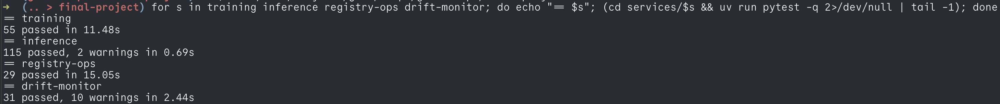

### The pipeline

`.github/workflows/final-project-ci.yml`, on `ubuntu-24.04-arm` — free on
public repositories and the same architecture as the cluster.

| Job | What it does |
|---|---|
| `lint` | the same pre-commit hooks that run on the machine |
| `test` | the five test suites above, one job each |
| `terraform` | `scripts/validate_terraform.sh`: fmt, `init -backend=false`, `validate`, both stacks |
| `gitops` | `scripts/validate_gitops.sh`: renders every chart and checks it with kubeconform |
| `build-and-scan` | builds each image, checks it does not run as root, Trivy: HIGH printed, CRITICAL fails |
| `secret-scan` | a full gitleaks scan of `final-project/` and the workflow files |
| `push-images` | pushes the four images to ECR, tagged with the commit SHA — skipped until `AWS_ROLE_ARN` is set |

Only `push-images` touches AWS, and it uses OIDC: no access key is stored
anywhere. It skips an image whose tag is already in ECR, because ECR tags are
immutable and a re-run of the same commit must not fail.

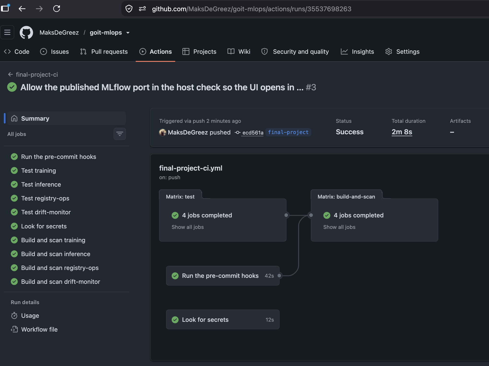

> `TODO(after deploy): replace this screenshot with one that also shows the
> terraform, gitops and push-images jobs green.`

### The two validation scripts

They are the same ones CI runs, so a failure can always be reproduced locally:

```bash
final-project/scripts/validate_terraform.sh   # needs terraform only
final-project/scripts/validate_gitops.sh      # needs helm, yq, kustomize, kubeconform
```

`validate_gitops.sh` renders the app-of-apps chart, then reads the list of
charts, versions, value files and parameters **out of the rendered
Applications** — so it checks exactly what Argo CD would deploy and no version
is written down twice. It also checks that every Helm parameter an Application
passes is really a key of the chart it passes it to. It ends with a table of
127 resources across 16 components.

### GitLab

`final-project/.gitlab-ci.yml` is the same pipeline written for GitLab, because
the assignment asks for GitLab CI and this project is on GitHub. The `lint`,
`terraform`, `gitops`, `tests` and `secret-scan` jobs were really run with
[gitlab-ci-local](https://github.com/firecow/gitlab-ci-local):

```bash
gitlab-ci-local --file final-project/.gitlab-ci.yml gitops
```

`build-and-scan` needs the docker-in-docker service of a real runner, and
`push-images` and `train` would need AWS to trust GitLab's OIDC provider as
well. Those three are written but untested, and each says so in a comment.

## Run everything locally

The stack in `docker-compose.yml` is the same picture as the cluster, only
smaller: MLflow with a Postgres behind it, two copies of the prediction API and
a PushGateway. The training job, the registry tool and the drift job are in the
profile `tools` and run once with `docker compose run`.

```bash
cd final-project
cp .env.example .env                  # only placeholders, nothing secret
docker compose --profile tools build  # first time only, about 4 minutes
docker compose up -d --wait
```

| What | Address | Note |
|---|---|---|
| MLflow UI and API | <http://localhost:5001> | 5001, because macOS uses 5000 for AirPlay |
| inference, staging | <http://localhost:8001> | follows the alias `staging` |
| inference, production | <http://localhost:8002> | follows the alias `production` |
| PushGateway | <http://localhost:9091> | where the drift job pushes its numbers |

Both API containers start before any model exists. They stay `not ready` (503
on `/health/ready`), keep asking the registry every ten seconds and start
serving as soon as the alias they follow points at a version — exactly what
happens in the cluster at step 6.

Then run the whole story once:

```bash
scripts/local_e2e.sh
```

It trains two versions, promotes one and then the other, rolls back, shows a
refused request (400) and a rate limited one (429), starts a throw-away
container with the wrong checksum to show that it never becomes ready, sends
normal and then drifted traffic, and lets the drift job compare the two. About
two and a half minutes, and it can be run as often as you like.

```bash
python3 scripts/send_traffic.py --mode normal  --count 400 --rate 15 --url http://localhost:8001
python3 scripts/send_traffic.py --mode drift   --count 400 --rate 15 --url http://localhost:8001
python3 scripts/send_traffic.py --mode invalid --count 5   --url http://localhost:8002
python3 scripts/send_traffic.py --mode burst   --count 80  --url http://localhost:8002

curl -X POST localhost:8002/predict -H 'Content-Type: application/json' -d '{
  "MedInc": 8.3252, "HouseAge": 41.0, "AveRooms": 6.9841, "AveBedrms": 1.0238,
  "Population": 322.0, "AveOccup": 2.5556, "Latitude": 37.88, "Longitude": -122.23}'

docker compose down        # keeps the models and the database
docker compose down -v     # removes them as well, for a clean start
```

### What a local run looks like

The stack after `docker compose up -d --wait`:

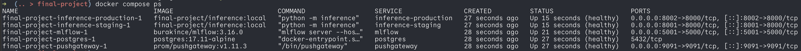

`scripts/local_e2e.sh` trains two versions, promotes the first one, replaces it
with the second one and then rolls back. Every change of the registry prints
one JSON audit line, and the production API follows within a few seconds:

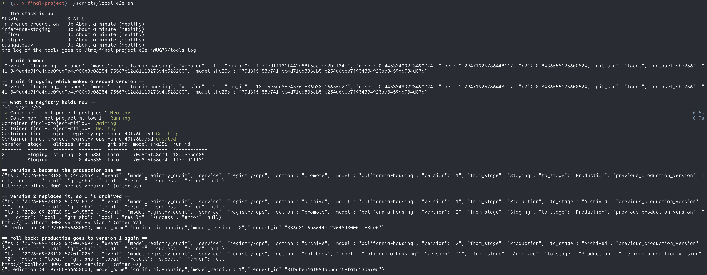

Bad input is refused with 400, too many requests with 429, and a model whose
file does not match the pinned checksum is never loaded, so the API stays "not
ready":

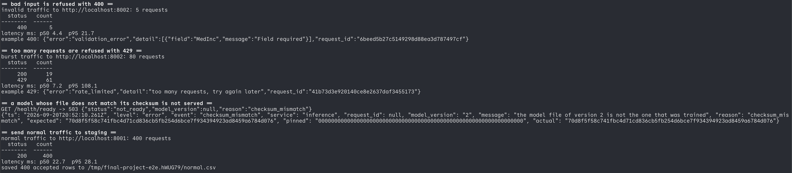

The drift job finds no drift in normal traffic and finds three moved features
in the second batch. The numbers end up in the PushGateway:

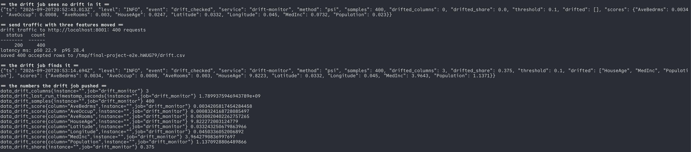

The model registry after the run. Version 1 is in production again, version 2
keeps the aliases `staging` and `previous-production`, and every version
carries the Git commit, the dataset hash, the model checksum and the metrics as
tags:

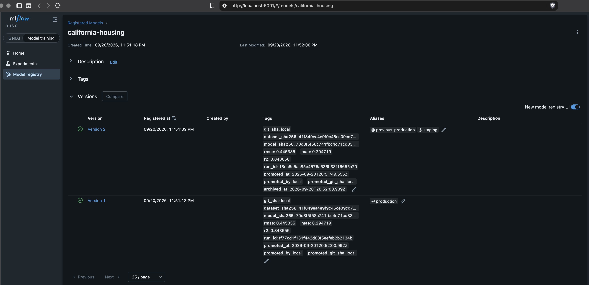

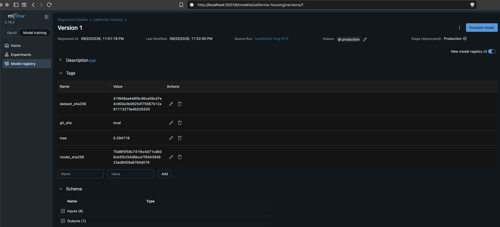

In this local run `git_sha` is `local`, because the images have no Git in them
and the value comes from `.env`. CI and the cluster pass the real commit. Both
versions have the same `model_sha256` because training is deterministic: the
same data and the same parameters give the same file.

### Images

All four are built from `python:3.13-slim`, install their dependencies with
`uv sync --locked` in a first build stage and run as user `10001`. The build
context is always `final-project/`, because the training and drift images ship
a file from `data/`.

| Image | Size (arm64) | Why it is that size |
|---|---|---|
| `registry-ops` | 239 MB | `mlflow-skinny` only, no numpy or pandas |
| `inference` | 591 MB | scipy, pandas and scikit-learn are needed to load the model |
| `training` | 922 MB | the full `mlflow` package on top of that |
| `drift-monitor` | 977 MB | Evidently brings plotly and statsmodels |

```bash
docker build -f services/inference/Dockerfile -t final-project/inference:local .
```

## Code quality

The checks are run by [pre-commit](https://pre-commit.com/). The list of hooks
is in `.pre-commit-config.yaml` in the root of the repository, because
pre-commit only reads it from there. Every hook is limited to this folder, so
the graded homework folders are never touched.

| Hook | What it does |
|---|---|
| pre-commit-hooks | whitespace, end of file, YAML syntax, big files, private keys, merge markers |
| ruff | lints and formats the Python code |
| yamllint | YAML style, configured in `.yamllint` |
| gitleaks | looks for secrets in what is about to be committed |
| terraform fmt | formats the Terraform files |

```bash
cd final-project && uv sync            # once

# from the root of the repository
uv run --project final-project pre-commit install
uv run --project final-project pre-commit run --all-files
```

The commands are run from the root because pre-commit needs to see the whole
repository.

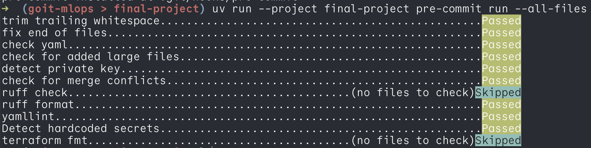

The same hooks run in GitHub Actions on every push (`final-project-ci`, job
`lint`):

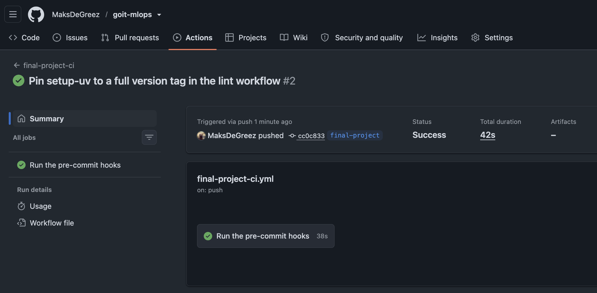

## Cost

There is no free tier on this AWS account, so the cluster is created at the
start of a working session and destroyed at the end of it.

| Item | Per hour |
|---|---|
| EKS control plane | $0.10 |
| 2 × `t4g.large` | $0.134 |
| NAT gateway | $0.045 |
| S3, ECR, Lambda, Step Functions, CloudWatch | cents per month |
| **Total** | **about $0.28**, roughly $6.70 a day |

The cluster is deliberately small, and the resource requests were measured
rather than guessed. Per namespace, read out of the rendered manifests:

| Namespace | CPU requests | Memory requests | Pods |
|---|---|---|---|
| `argocd` | 250m | 896Mi | 5 |
| `mlops-system` | 350m | 1408Mi | 3 |
| `monitoring` | 580m | 2240Mi | 10 |
| `staging` | 100m | 512Mi | 2 |
| `production` | 500m | 2560Mi | 10 |
| short lived: drift job, registry hook, canary surge pod | up to 350m | up to 704Mi | up to 3 |
| **total of the above** | **2130m** | **8320Mi** | **33** |

The two `t4g.large` nodes give about **3.8 CPUs and 12 GiB** to pods.
`kube-system` takes roughly another 0.7 CPU for the EKS add-ons (CoreDNS,
kube-proxy, VPC CNI, the EBS CSI driver, the Pod Identity agent) — that one row
is an estimate from the add-on defaults, not a measurement.

> `TODO(after deploy): replace the kube-system estimate with the real numbers
> from "kubectl describe node" and "kubectl top nodes".`

This is why the inference CPU request is `50m` in both `envs/` files and not
the `100m` of the chart default: at `100m` the two inference namespaces alone
would ask for 1.3 CPU — a third of the cluster — for pods that answer in about
5 ms.

## Teardown

**The order matters.** Argo CD created the volumes, not Terraform, so Terraform
cannot delete them; and if Argo CD is removed first, nothing is left to process
the finalizers on its Applications and the namespace hangs in `Terminating`
for ever.

```bash
# 1. Delete the root Application. The finalizer makes this remove every child
#    Application, every workload and every PVC, which releases the EBS volumes.
kubectl -n argocd delete application mlops-platform
kubectl get pvc -A          # wait until this is empty

# 2. The platform stack.
cd final-project/terraform/stacks/platform && terraform destroy

# 3. The infra stack, last: it deletes the cluster the platform stack used.
cd ../infra && terraform destroy
```

Then check that nothing is left — a resource created from inside the cluster is
in no Terraform state. The exact commands, and what to do when a namespace
still hangs, are in [`RUNBOOK.md`](RUNBOOK.md#teardown).

The Terraform state bucket is kept on purpose and is not managed by Terraform.

## Documents

| Document | What is in it |
|---|---|
| [`RUNBOOK.md`](RUNBOOK.md) | rolling out a model, rolling back, and twelve incidents with exact commands |
| [`ADR.md`](ADR.md) | why canary, what it costs, what would be done differently |
| [`docs/threat-model.md`](docs/threat-model.md) | five threats, the control for each, the residual risk |
| [`docs/escalation-policy.md`](docs/escalation-policy.md) | which alert goes to whom, and how fast |
| [`terraform/README.md`](terraform/README.md) | the two stacks, the modules, apply and destroy |
| [`gitops/README.md`](gitops/README.md) | the app of apps, the sync waves, every component |
| [`gitops/charts/inference/README.md`](gitops/charts/inference/README.md) | the canary chart in detail |
| [`gitops/charts/drift-monitor/README.md`](gitops/charts/drift-monitor/README.md) | the drift CronJob |
| [`rbac/README.md`](rbac/README.md) | the three groups and the permission matrix |
| [`lambda/README.md`](lambda/README.md) | the two Lambda handlers and the pipeline input |
| [`data/README.md`](data/README.md) | where the dataset came from and how the reference sample was made |
| `services/*/README.md` | each service: settings, endpoints, metrics, log events |
