# Demo trace

Everything on this page was recorded on the real system on 21 September 2026:
one EKS cluster `mlops-final` in `us-east-1`, Kubernetes 1.35.8, two
`t4g.large` arm64 nodes, Argo CD 3.5.3, MLflow 3.16.0.

The four states the assignment asks for are in the
[README](../README.md#demo-trace). This page is the whole story, in the order
it happened, with the numbers that were measured while it happened.

| # | Step | Screenshots |
|---|---|---|
| 1 | [The cluster is up](#1-the-cluster-is-up) | 17, 19 |
| 2 | [Argo CD deploys everything](#2-argo-cd-deploys-everything) | 18, 20 |
| 3 | [A training run through Step Functions](#3-a-training-run-through-step-functions) | 22, 21 |
| 4 | [The first promotion](#4-the-first-promotion) | 25, 26, 27, 28, 29 |
| 5 | [Version 2, with traffic](#5-version-2-with-traffic) | 30, 31, 33, 32 |
| 6 | [Rollback with git revert](#6-rollback-with-git-revert) | 34, 35 |
| 7 | [The canary that aborted by itself](#7-the-canary-that-aborted-by-itself) | 36, 37, 38, 39 |
| 8 | [Live monitoring](#8-live-monitoring) | 23 |
| 9 | [Drift and the alert that fired](#9-drift-and-the-alert-that-fired) | 40, 41, 42 |
| 10 | [Security: RBAC, bad input, rate limit, audit trail](#10-security-rbac-bad-input-rate-limit-audit-trail) | 43, 44, 45 |
| 11 | [What it costs](#11-what-it-costs) | 46 |

## 1. The cluster is up

`terraform apply` in `stacks/infra` created **75 resources in about 18
minutes**, almost all of it the EKS control plane. `stacks/platform` added
**31 resources in about 6 minutes**.

Both nodes report **110 pods** as their limit, which is the proof that prefix
delegation on the VPC CNI is working — without it a `t4g.large` stops at 35.

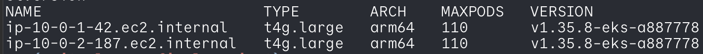

Forty-seven pods were running in total. Everything outside `kube-system`:

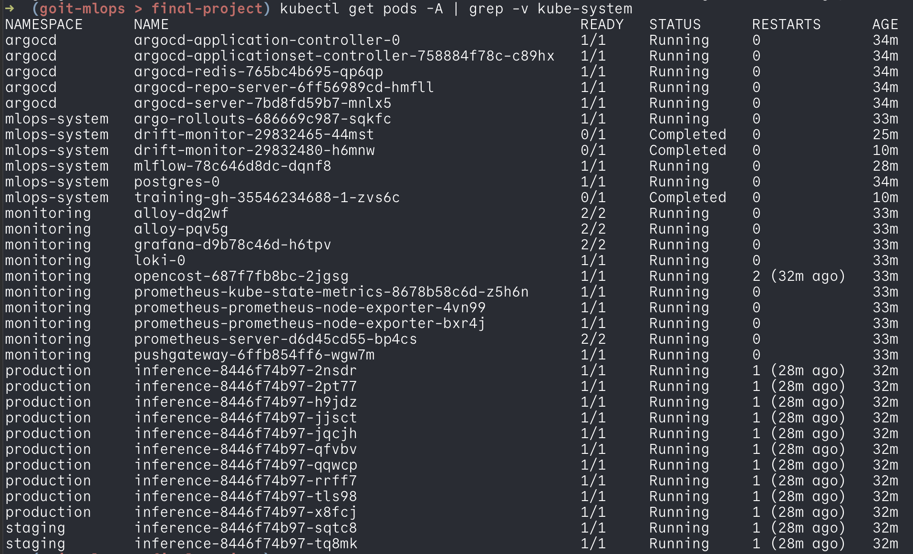

Two restart counters in that list are expected on a first deployment and mean
nothing is wrong:

- the ten `production` and two `staging` inference pods show `RESTARTS 1`. They
  started before MLflow was reachable, failed the startup probe once and were
  restarted. After that they loaded the model and stayed up.
- `opencost` shows `RESTARTS 2`. It waits for Prometheus, which is in a later
  sync wave.

## 2. Argo CD deploys everything

One root Application, `mlops-platform`, creates fourteen children and syncs
them in four waves. All **fifteen reached Synced and Healthy**, about eight
minutes after the platform stack finished.

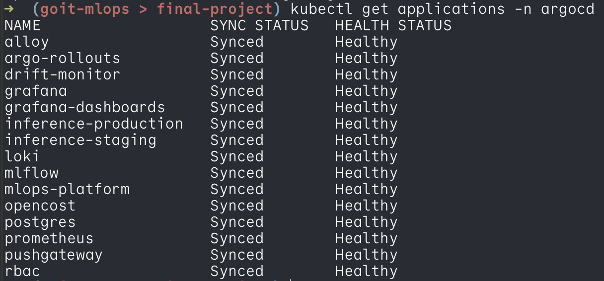

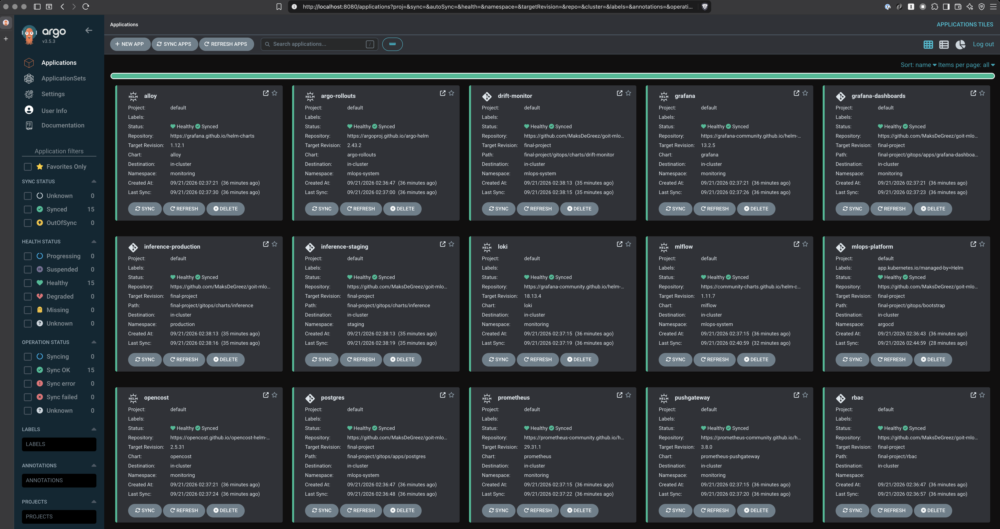

Two things had to be fixed before this picture was green, and both are now in
the repository:

- the MLflow chart has to **create its own service account**
  (`serviceAccount.create: true`). Terraform only attaches the Pod Identity
  role to that name; it does not create the object.
- an Application must **not** set `directory.recurse: false`. Argo CD drops
  values that equal the default, so the live object never matched Git and the
  root Application stayed `OutOfSync` for ever.

## 3. A training run through Step Functions

**Actions → final-project-train → Run workflow**, all inputs empty. The whole
workflow took **1 minute 18 seconds**; the Step Functions execution inside it
took **54 seconds**.

The chain is: GitHub Actions → OIDC role → `states:StartExecution` →
`ValidateInput` Lambda → `eks:runJob.sync` Kubernetes Job in `mlops-system` →
MLflow → `LogMetrics` Lambda. It worked on the first attempt, with an **EKS
access entry** and no `aws-auth` ConfigMap.

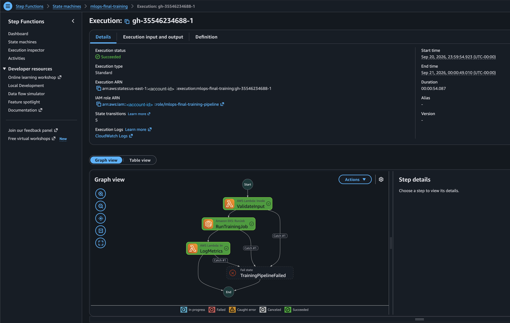

The job registered version 1 and gave it the alias `staging`. Every tag the
model registry contract asks for is there: the Git commit, the dataset hash,
the checksum of the model file, the three metrics and the MLflow run id.

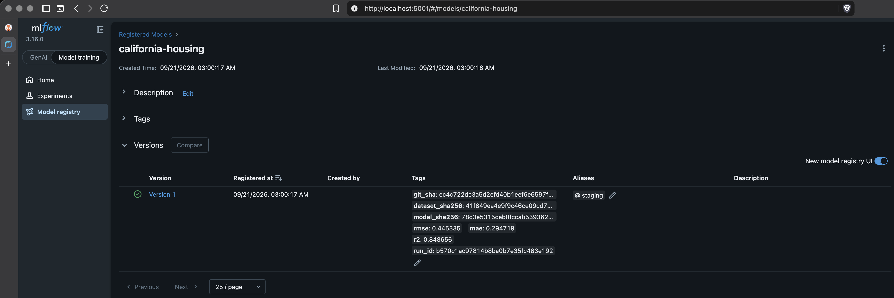

| Run | Parameters | Version | rmse | mae | r2 |
|---|---|---|---|---|---|
| 1 | defaults (`max_iter` 200) | 1 | 0.4453 | 0.2947 | 0.8487 |
| 2 | `max_iter` 50 | 2 | 0.4897 | 0.3297 | 0.8170 |

Run 1 gives exactly the numbers a local run gives, which is the point of
pinning the dataset hash. Run 2 was trained on purpose with a lower iteration
limit, so version 2 is a real, slightly worse model with a different checksum —
something worth rolling back from later.

## 4. The first promotion

Commit `70b370f` set `modelVersion: "1"` and `modelSha256` in
`gitops/envs/production.yaml`. Nothing else.

The rollout ran the **full canary**: one new pod out of ten, a two minute
pause, five out of ten, a two minute pause, then all ten. From start to Healthy
it took about **five minutes**. The background analysis asked Prometheus every
30 seconds and all **nine measurements passed**.

Step 1 of 4 — `SetWeight: 10`, one new pod next to nine old ones:

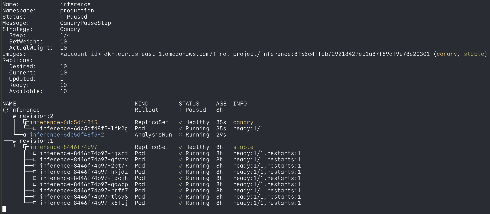

Step 3 of 4 — `SetWeight: 50`, five and five:

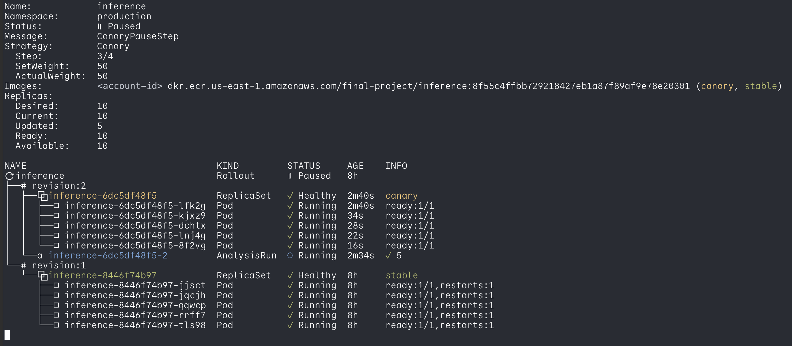

Step 4 of 4 — all ten pods on the new revision, the analysis `Successful` with
nine good measurements, the old ReplicaSet scaled down:

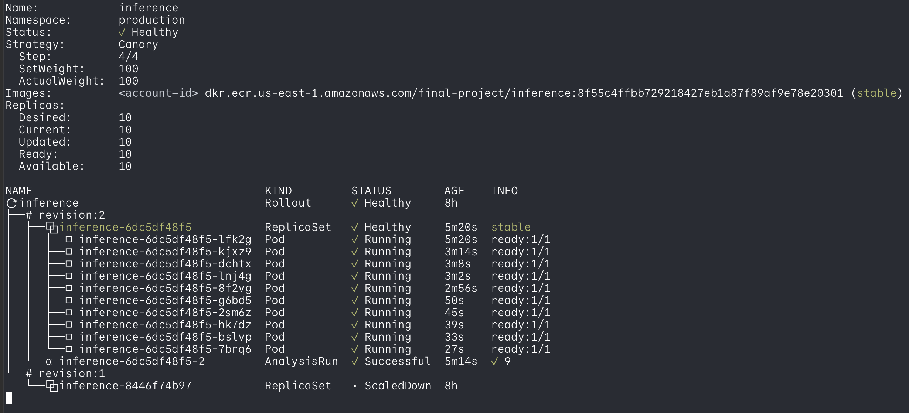

Only now, with the Application Healthy, does the `PostSync` hook Job run. It
took 9 seconds and printed one audit line:

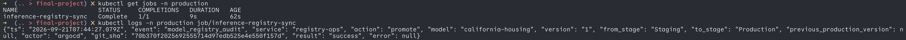

```json
{"event": "model_registry_audit", "action": "promote", "model": "california-housing",
 "version": "1", "from_stage": "Staging", "to_stage": "Production",
 "previous_production_version": null, "actor": "argocd",
 "git_sha": "70b370f2025692555714d97edb525e4e550f157d", "result": "success"}
```

`$ARGOCD_APP_REVISION` really does reach the Job: the `git_sha` in the line is
the promotion commit. The registry agrees a few minutes after Git, never
before — that window is deliberate and is explained in [`../ADR.md`](../ADR.md).

The registry now has version 1 under the alias `production`, with three extra
tags the hook wrote: `promoted_at`, `promoted_by` and the commit.

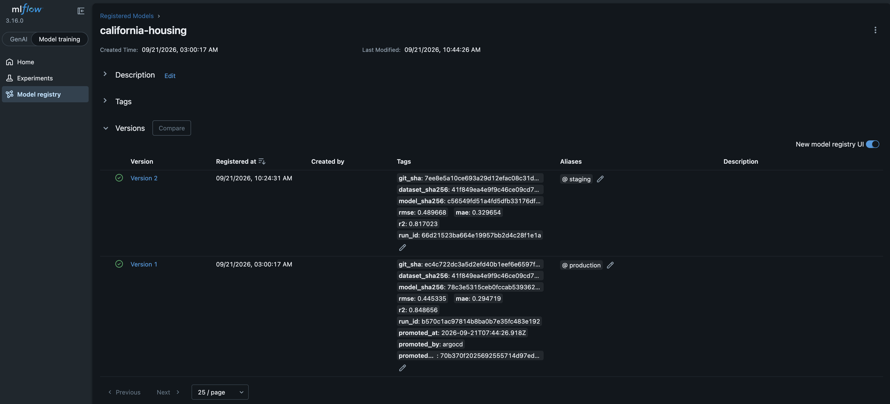

## 5. Version 2, with traffic

Commit `4572926` promoted version 2. This time traffic was running at about
**10 requests per second from inside the cluster**:

```bash
scripts/cluster_traffic.sh production --mode normal --count 3000 --rate 10
```

That detail matters. A `kubectl port-forward` connects to **one pod**, so a
canary would get either all of the traffic or none of it. The script runs a
small pod in the cluster which calls the Service, and the Service spreads the
requests over old and new pods.

At the 50 % step the dashboard shows five pods on each version and both of them
answering:

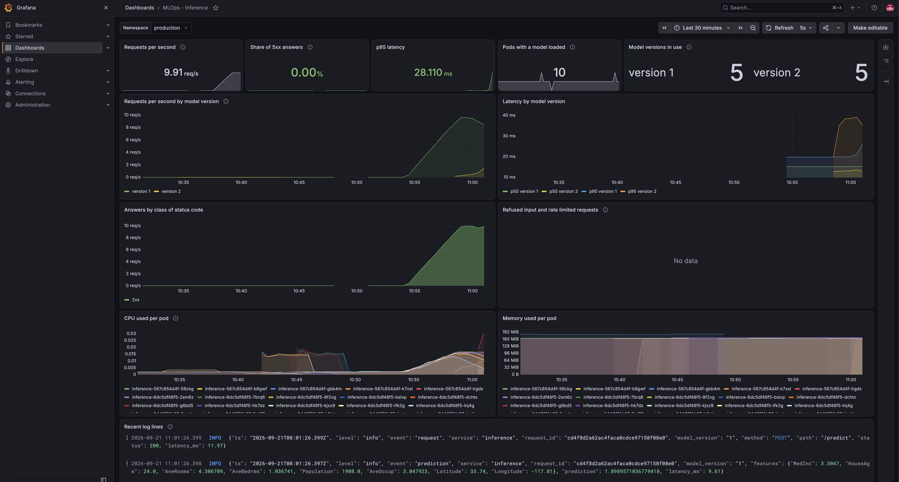

When the canary finished, version 1 was gone and everything was on version 2.
No 5xx at any point, p95 around 35 ms:

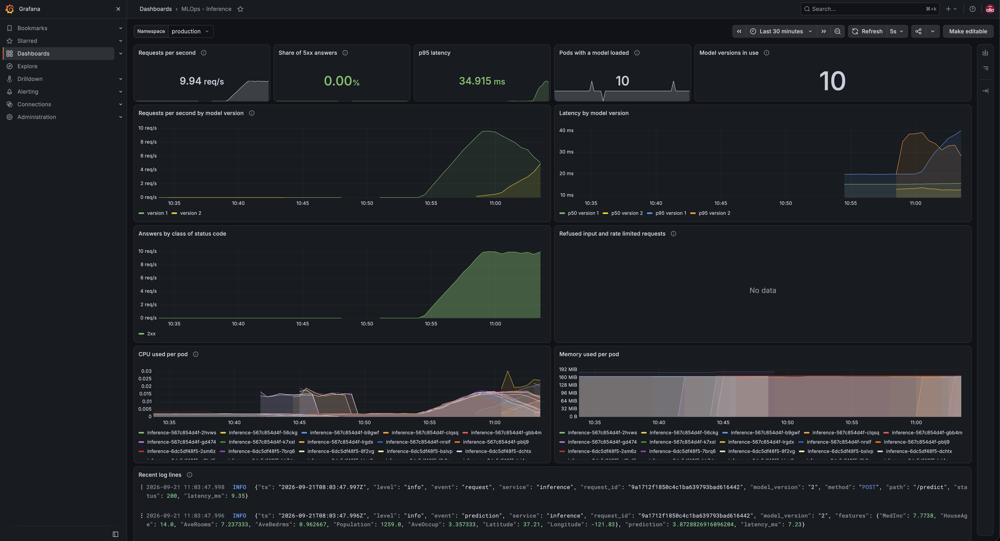

The hook printed **two** lines this time — one to archive the version that was
live, one to promote the new one:

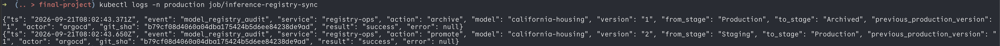

Note the `git_sha` of these two lines is `b79cf08`, not the promotion commit.
That is correct and worth knowing: the line carries the commit **Argo CD had
synced when the hook ran**, and two unrelated commits had landed on the branch
during the canary.

MLflow with the *New model registry UI* switch turned off shows the stages the
assignment words the workflow in:

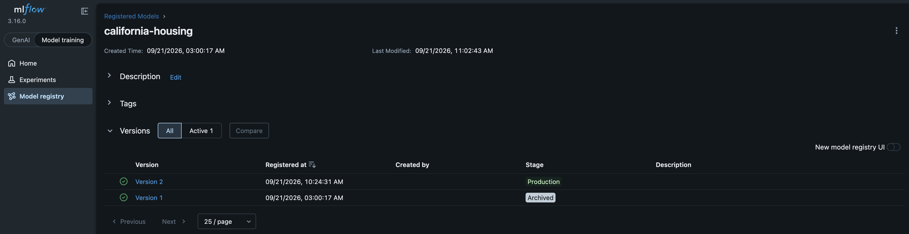

## 6. Rollback with git revert

One command, no new commit written by hand:

```bash
git revert 4572926      # -> commit f0ec3ff
git push
```

Argo CD picked it up, the Rollout ran the same careful canary in the other
direction, and the hook moved the registry back:

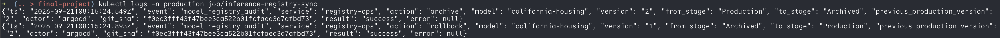

```json
{"action": "archive",  "version": "2", "from_stage": "Production", "to_stage": "Archived"}
{"action": "rollback", "version": "1", "from_stage": "Archived", "to_stage": "Production",
 "previous_production_version": "2", "actor": "argocd", "git_sha": "f0ec3fff..."}
```

The Git history is the whole audit trail of what production ran and when:

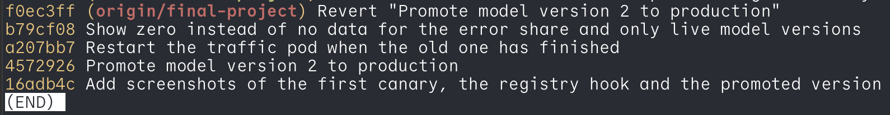

## 7. The canary that aborted by itself

This is bonus task **G2**: a bad version is taken out without anybody touching
anything.

Commit `25edf2a` promoted version 2 again, this time with `faultRate: 0.5` — a
fault injection switch that makes that share of `/predict` calls answer 500.
Traffic was running at 10 requests per second.

The analysis measures the 5xx share of the **new version only**, every 30
seconds, against a limit of 0.05:

| Measurement | Value | Verdict |
|---|---|---|
| 1 | `[]` — the new pod had not served anything yet | counted as success |
| 2 | 0.548 | failed |
| 3 | 0.583 | failed |
| 4 | 0.572 | failed |

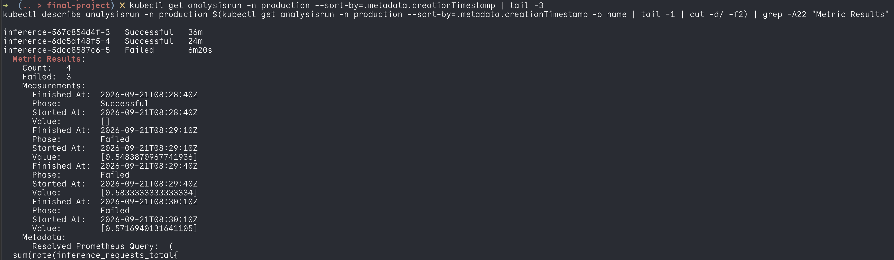

`failureLimit` is 2, so the third failure ended it. The rollout aborted itself
about **two minutes after the push**, with the message
`Metric "error-rate" assessed Failed due to failed (3) > failureLimit (2)`.

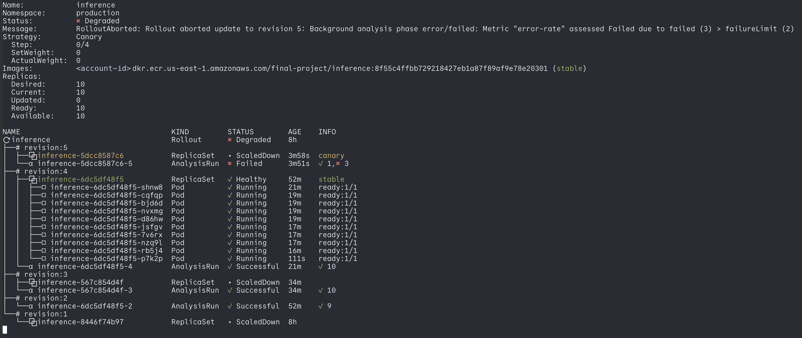

All ten pods are on the stable revision — the version that was there before.
The Argo CD Application goes `Degraded`, which is how a human finds out:

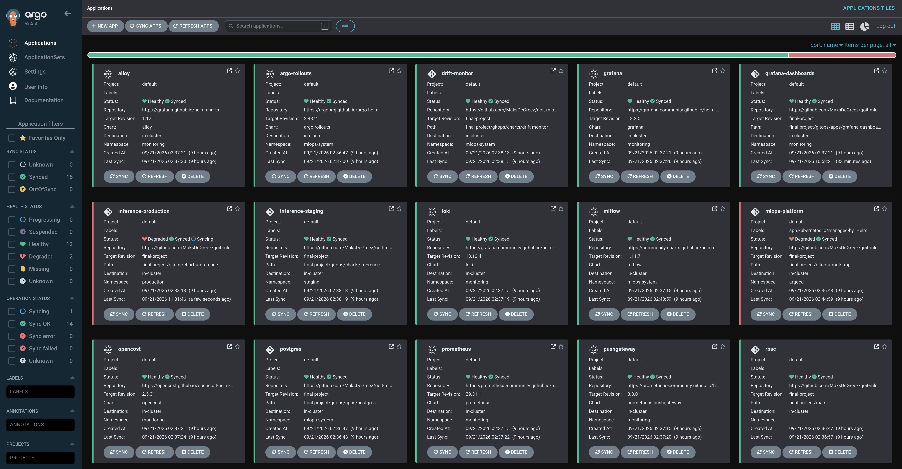

How much damage the bad version did is visible on the dashboard. Only one pod
of eleven served the faulty version, and half of its answers were 500, so the
worst the whole service ever showed was **2.08 % of 5xx**, for about two
minutes:

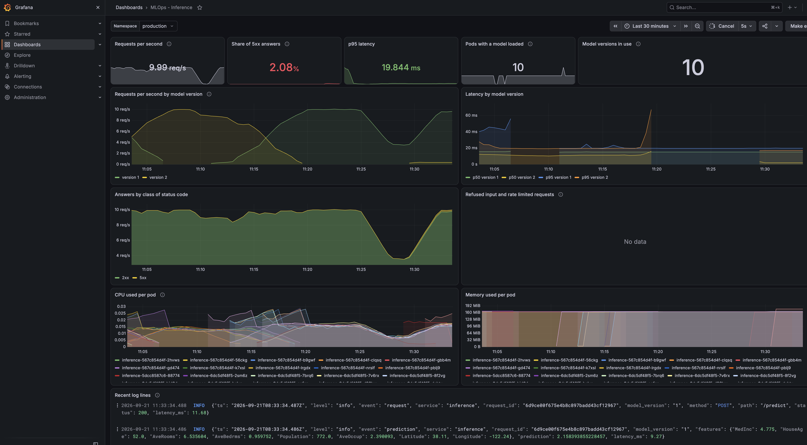

The `PostSync` hook never ran, so MLflow still said version 1 was the
production version — which was true. Cleaning up was one more `git revert`
(commit `5a630d7`).

One operational detail that only shows up on a real cluster: after an abort
Argo CD keeps **retrying the failed sync** (retry limit 5 with backoff, five to
eight minutes) and applies the revert only afterwards. Waiting works. Pressing
**Terminate** on the running operation in the Argo CD UI skips the wait. Both
are in [`../RUNBOOK.md`](../RUNBOOK.md#a-canary-aborted-by-itself).

## 8. Live monitoring

The *Inference* dashboard during a busy period: request rate, share of 5xx, p95
latency, how many pods have a model loaded and which versions they serve — then
the same split by model version, the answer classes, refused and rate limited
requests, CPU and memory per pod, and the newest log lines straight from Loki.

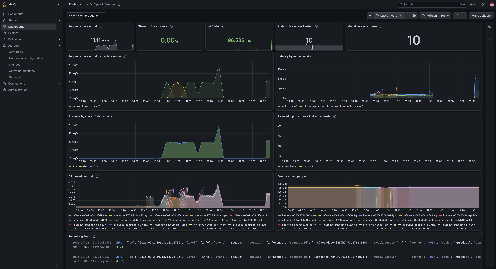

Every pod uses about 160 MiB with the model loaded, well inside the 256Mi
request. The p95 of 97 ms in this picture was taken right after the 3000
request burst of section 10; in normal traffic it sits between 20 and 35 ms,
far below the 250 ms the alert watches.

## 9. Drift and the alert that fired

The `drift-monitor` CronJob runs every 15 minutes. It reads the newest 5000
`prediction` log lines back out of Loki, compares them with
`data/reference.csv` using Evidently, and pushes the result to the PushGateway.

**Normal traffic:** drifted share 0.0, every PSI below 0.012.

**After 6000 drifted requests** (`--mode drift` moves three features: `MedInc`
× 2.5, `HouseAge` into 1–6, `Population` × 2):

| Run | Share | PSI `HouseAge` | PSI `MedInc` | PSI `Population` |
|---|---|---|---|---|
| first, window still mixed | 0.375 | 1.46 | 0.82 | 0.24 |
| next run, full window | 0.375 | 9.63 | 3.50 | 0.37 |

PSI is a distance, so a high value means drift. The columns that did not move
stayed under 0.005, which is what makes the three that did move obvious.

The screenshot below was taken later, when normal traffic had already refilled
part of the window: the share had fallen back to 0.25 and only the two
strongest columns were still over the line. That fall is itself useful — it
shows the metric follows the live data and does not latch.

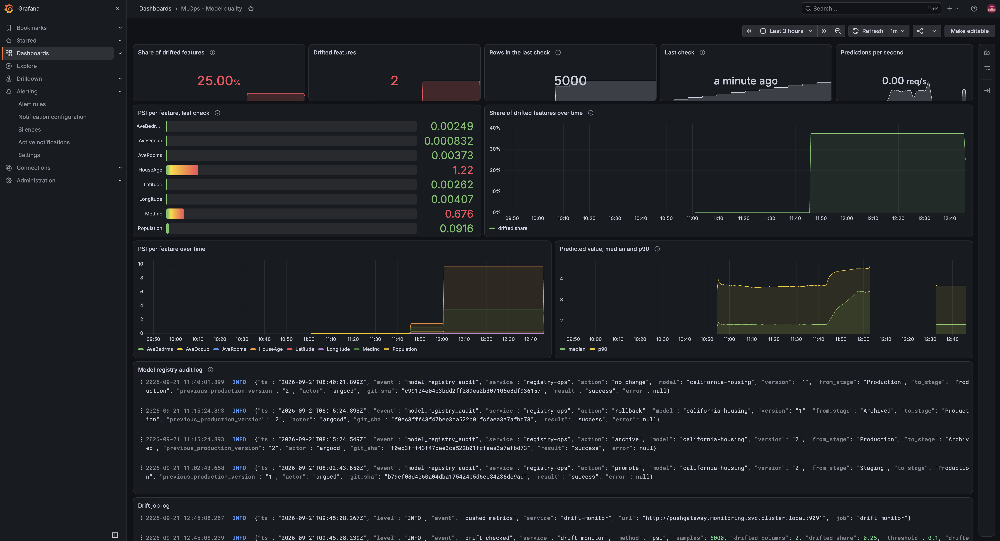

The Grafana rule *The live data no longer looks like the training data* went
from Normal to **Firing**:

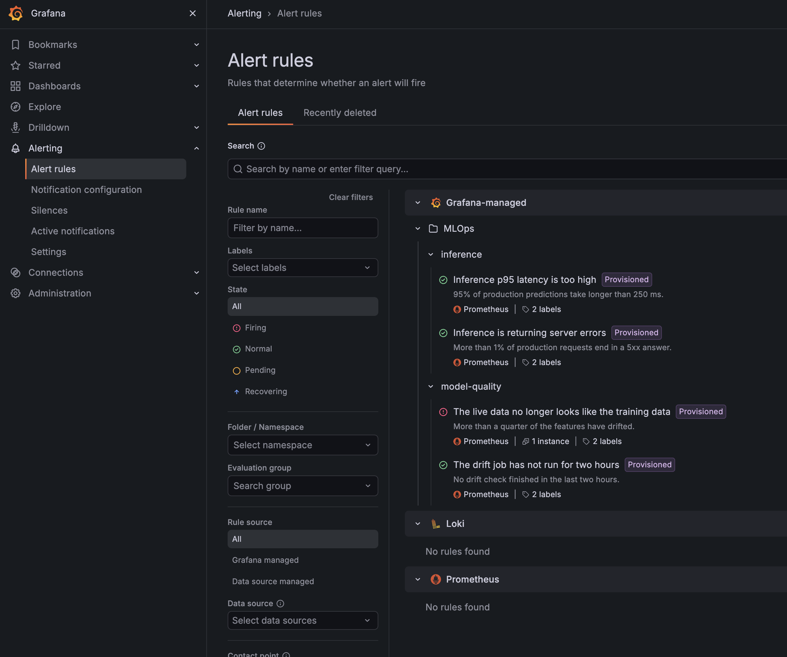

Its details show exactly why: `max(data_drift_share)` reduced to 0.375, the
threshold is 0.25, the pending period is 5 minutes, and the `runbook_url`
annotation points at
[`RUNBOOK.md#data-drift`](../RUNBOOK.md#data-drift).

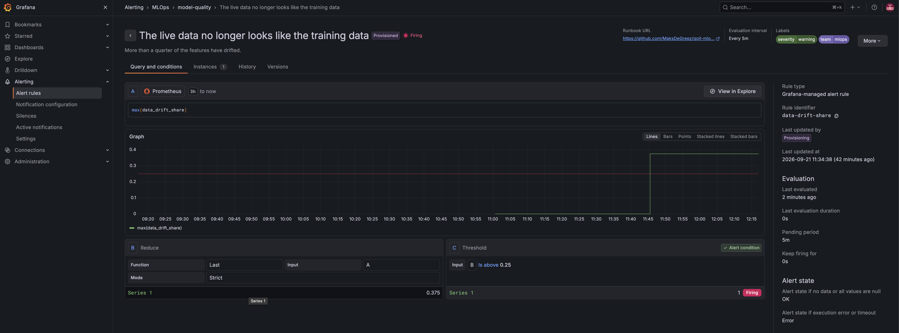

## 10. Security: RBAC, bad input, rate limit, audit trail

`scripts/check_rbac.sh` asks the cluster 32 `kubectl auth can-i` questions for
the three groups and compares every answer with the table in
[`../rbac/README.md`](../rbac/README.md). **All 32 matched.** The denials matter
as much as the allowances: an `mlops-engineer` cannot read a Secret, cannot
`exec` into a production pod and cannot patch the production Rollout, but can
patch `rollouts/status`, which is what aborting a canary needs.

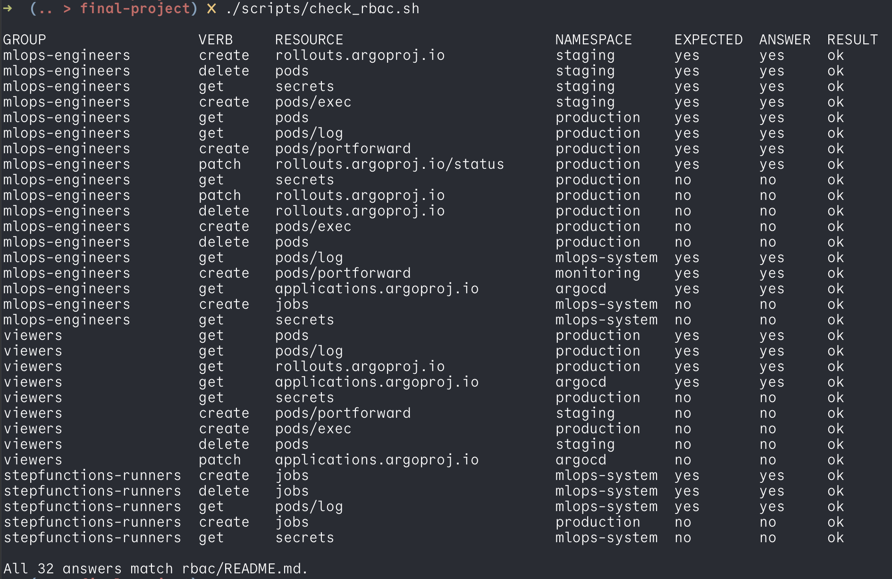

Input validation and rate limiting, tested against the real Service from inside
the cluster:

- 20 requests with a missing field → **20 × HTTP 400**, with field names only
  and no stack trace, no library name and no echo of the input.
- a burst of 3000 requests → **2976 × 200 and 24 × 429**. The limit is 20
  requests per second **per pod** and there are ten pods, so about 200 per
  second get through. That is honest and is written down in the
  [threat model](threat-model.md).

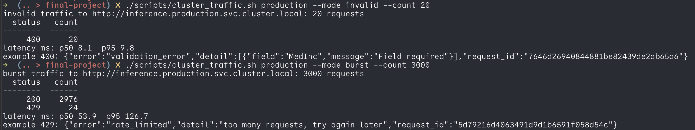

Every change of the model registry is one JSON line in Loki. This is the whole
promotion story of the day in one query in Grafana → Explore:

```logql
{app="registry-ops"} | json | event="model_registry_audit"
```

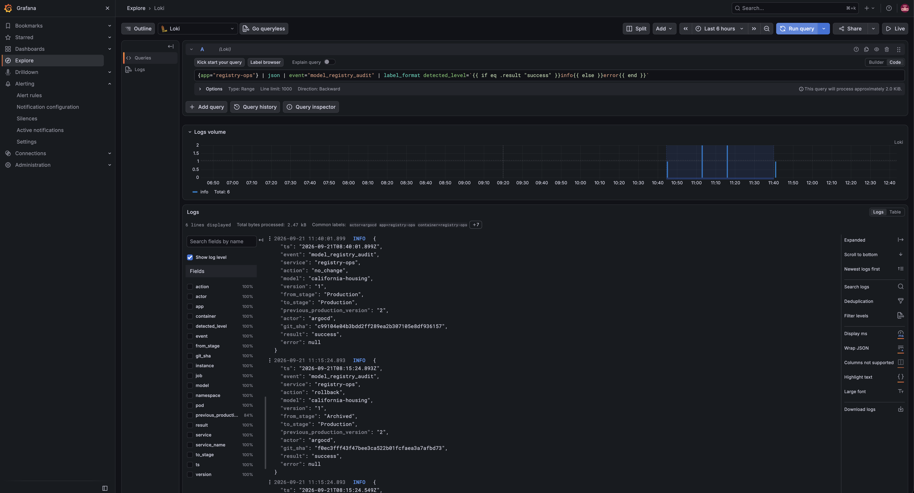

The lines carry a `level` field on purpose. Without it Loki guessed the level
from the key name `"error": null` and showed a successful promotion in red.

## 11. What it costs

The cost dashboard is bonus task **G4**. OpenCost prices the nodes and the EBS
volumes from the AWS price list and Prometheus stores the result:

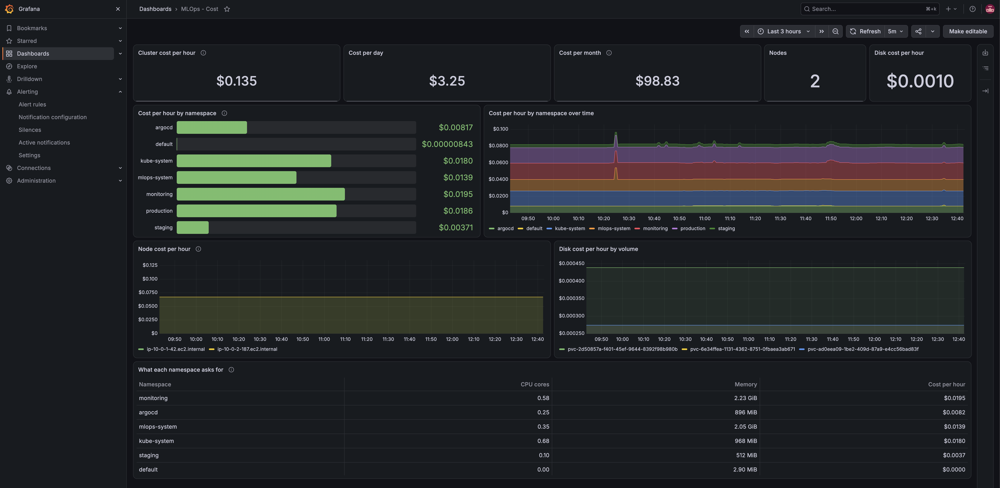

| What | Measured |
|---|---|
| nodes and disks, per hour | $0.135 |
| per day | $3.25 |
| per month | $98.83 |
| most expensive namespace | `monitoring`, $0.0195 per hour |

OpenCost only sees what runs **inside** the cluster. It cannot see the EKS
control plane ($0.10 per hour) or the NAT gateway ($0.045 per hour), so the
real rate is about **$0.28 per hour**. The dashboard is still the useful one:
it answers "which namespace is expensive", which the AWS bill never does.

## What this trace does not show

Three limits, stated on purpose:

- **No traffic means no signal.** The canary analysis treats an empty
  Prometheus answer as success, so a rollout that nobody calls always passes.
  Every canary above was run with traffic for exactly this reason.
- **The split is by pods, not by requests.** "10 %" is one pod out of ten. The
  real share wobbles around that number.
- **Nothing is public.** Every screenshot above was taken through
  `kubectl port-forward`. The reasoning is in the
  [README](../README.md#access-to-the-user-interfaces).
